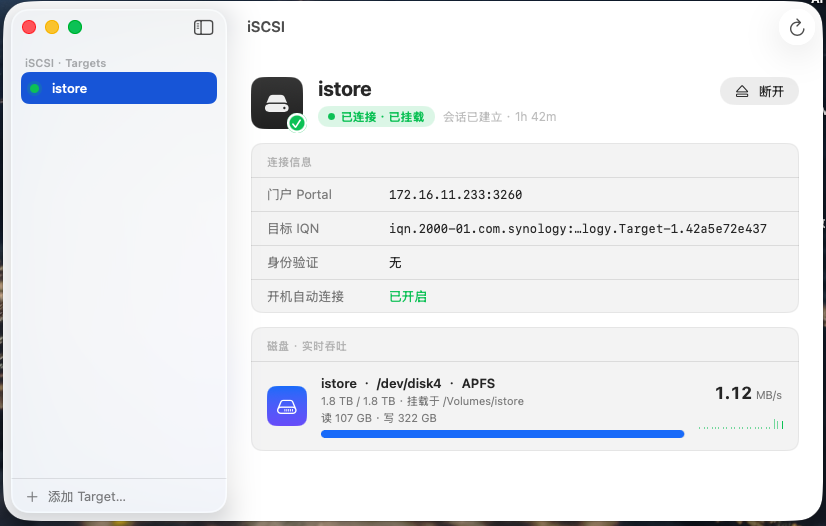
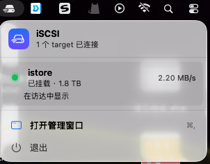
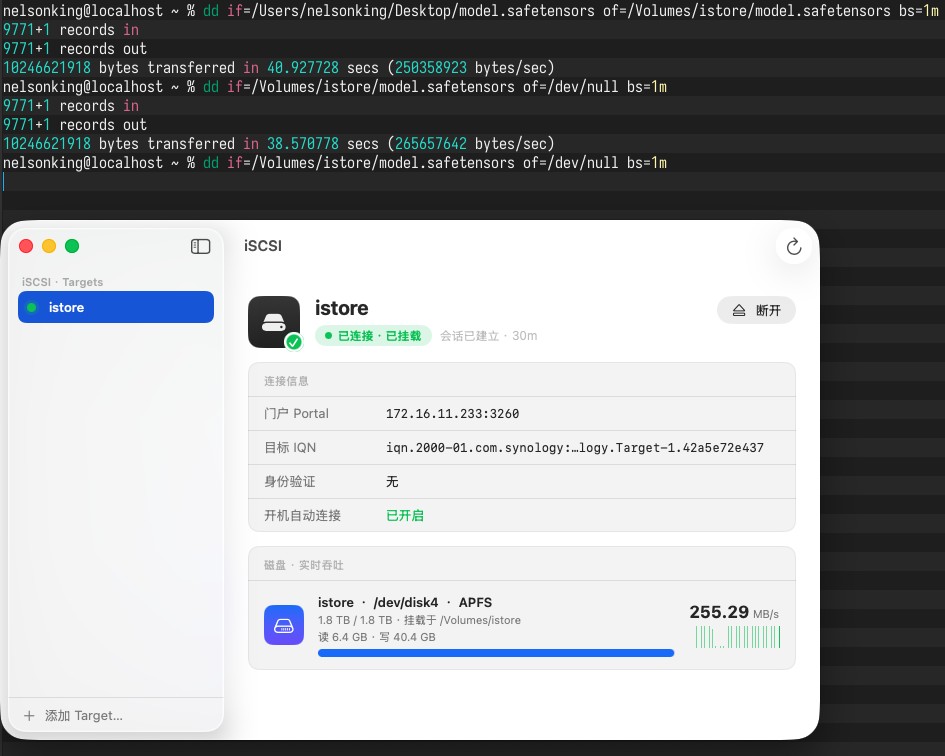

<div align="center">

# iSCSI for Apple Silicon

**面向 Apple Silicon 的原生免费 iSCSI 客户端，带图形界面。**

*把远程 iSCSI 存储（NAS、SAN、TrueNAS、fnOS、LIO 等）挂载成 Mac 上的原生磁盘。相较于使用SMB、NFS等存储能力 ISCSI无文件协议，直接把网络存储当成本地块使用，对于小文件有有着非常高的响应速度，

</div>

---

## 界面预览
| 应用主界面 | 菜单栏 |
|:---:|:---:|
|  |  |
| |

---

## 这是什么

macOS 多年前曾内置 iSCSI 发起器，后来被移除。优秀的开源项目
[iscsi-osx/iSCSIInitiator](https://github.com/iscsi-osx/iSCSIInitiator)
（Nareg Sinenian 出品）因 Apple 移除了系统扩展所需的内核 socket API 而归档。

本项目把那个**内核扩展发起器移植到现代 Apple Silicon（macOS 13+，arm64e）**，
修复了 x86→arm64 移植中才暴露的一系列 bug，并补上了**原生 SwiftUI 图形界面、
一键安装包和内置设置引导**。

全部代码仅用 **Command Line Tools** 即可构建，无需完整 Xcode。

---

## 架构

```
 SwiftUI 应用  ──►  iscsictl  ──►  iscsid（launchd 后台服务） ──►  iSCSIInitiator.kext
  （图形界面）      （命令行）         （会话 / 发现 / 认证）           （虚拟 SCSI HBA）
                                                                            │
   diskutil / iostat  ◄──────────  macOS 存储栈  ◄──────────────────────────┘
```

- **内核扩展（kext）** 实现一个虚拟 SCSI HBA，通过 TCP 走 iSCSI 有线协议（RFC 3720）。
  SCSI 数据路径完全在内核态，直接收发 iSCSI PDU。
- **iscsid 后台服务** 只负责会话与连接的生命周期：登录协商、CHAP 认证、SendTargets
  发现、断线重连，不参与数据传输。
- **图形界面** 不直接跟内核通信，而是驱动 `iscsictl`，通过 `diskutil` 读取挂载点与
  容量，通过 `iostat` 采样实时吞吐。

---

## 功能

- 🖥 **菜单栏应用 + 管理窗口** —— 一键连接 / 断开。
- 🧭 **内置设置引导** —— 检测 SIP 状态，引导关闭 SIP、批准内核扩展、启动后台服务，
  全程有实时状态提示。
- 🔌 **静态登录 + CHAP 认证** —— 稳定可靠的连接路径。
- 💾 **自动挂载 + 实时吞吐** —— 查看磁盘、容量、已用 / 总量、实时读写速率（MB/s）
  和累计读写量。
- 🔁 **断线自动重连** —— 网络断开恢复后自动重新连接（由后台服务接管）。
- 🌏 **双语** —— 中文 / 英文，跟随系统语言。
- 📦 **一键 `.pkg` / `.dmg` 安装包** —— kext、后台服务、命令行、框架和 App 一次装好，
  首次批准扩展后即可使用。

---

## 系统要求

- Apple Silicon Mac（M1 或更新），macOS 13 或更新。
- **必须关闭 SIP**，并将启动安全性降级为 *降低安全性*（Reduced Security）并允许
  第三方内核扩展。Apple 对**任何**第三方内核扩展都有此要求——App 的设置引导会带你完成。

> ⚠️ 关闭 SIP 会降低 Mac 的安全性，请理解此权衡后再操作。

---

## 安装

1. 从 [Releases](../../releases) 下载最新的 `iSCSI-for-Apple-Silicon-x.y.z.dmg`。
2. **先关闭 SIP**（恢复模式 → 终端 → `csrutil disable`，再到启动安全性实用工具 →
   *降低安全性* + 允许内核扩展），然后重启。
3. 打开 `.dmg`，运行 `.pkg`。
4. 从「应用程序」启动 **iSCSI**。设置引导会完成扩展批准（可能需再重启一次）。
   然后添加目标并连接即可。

---

## 从源码构建

```bash
git clone <本仓库> && cd iSCSIInitiator

# 1. 内核扩展 + 用户态工具（后台服务、iscsictl、框架）
./build_all.sh

# 2. SwiftUI 应用（渲染图标、编译、打包 iSCSI.app）
cd App && ./build_app.sh && cd ..

# 3. 安装包（.pkg 封装为 .dmg）
cd Installer && ./build_installer.sh 1.0.0
```

也可以把构建产物就地安装用于开发调试：

```bash
sudo ./install.sh          # 安装并加载 kext + 后台服务 + CLI + 框架
open App/build/iSCSI.app   # 运行图形界面
```

### ⚠️ Command Line Tools 的 modulemap 缺陷

较新的 Command Line Tools 在 `usr/include/swift/` 下同时带了 `module.modulemap` 和
`bridging.modulemap`，两者都定义了模块 `SwiftBridging`，导致 clang 报 *重定义*，任何
导入 Foundation / SwiftUI 的 Swift 文件都无法编译。两个文件除版权年份外完全相同。
`App/build_app.sh` 会检测并清空过期的 `module.modulemap`（保留 `.bak` 备份）。手动处理：

```bash
sudo cp /Library/Developer/CommandLineTools/usr/include/swift/module.modulemap{,.bak}
sudo sh -c ': > /Library/Developer/CommandLineTools/usr/include/swift/module.modulemap'
# 还原：sudo mv .../module.modulemap.bak .../module.modulemap
```


## 使用说明

完整使用指南（设置、添加目标、自动连接、故障排查）见 **[USAGE.md](USAGE.md)**。

> 提示：这是**菜单栏 App，没有 Dock 图标**——启动后看屏幕右上角。

---

## 致谢与许可

- 原始内核发起器：[**iSCSIInitiator**](https://github.com/iscsi-osx/iSCSIInitiator)
  © Nareg Sinenian —— **BSD-2-Clause**。
- 本 Apple Silicon 移植、图形界面、安装包与设置引导沿用相同的 **BSD-2-Clause**
  许可，见 [LICENSE.md](LICENSE.md)。

*与 Apple 无关联，亦未获其背书。"Apple Silicon" 是 Apple Inc. 的商标。*
